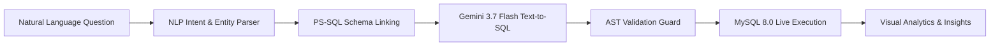

# 🤖 Data Analyst AI Studio — Flowise & PS-SQL

> **Autonomous Natural Language to SQL Analytics Agent** powered by **Flowise Orchestration Graph**, **PS-SQL Phrase-Based Schema Linking**, **AST SQL Validation**, and **Google Gemini 3.7 Flash**.

---

## 🏛️ Project Architecture & Folder Structure

```
data-analyst-ai-agent-with-flowise-using-ps-sql/
├── backend/                       # Python FastAPI Analytical Backend
│   ├── main.py                    # REST controller & Lifespan application
│   ├── agent_orchestrator.py      # Master coordinator (NLP, Schema, Text2SQL, Execution)
│   ├── analyzer.py                # Power BI KPI engine, anomaly detection & executive narration
│   ├── benchmarks.py              # Automated SQL benchmark suite
│   ├── database_registry.py       # Universal multi-DB connector & connection pooling
│   ├── flowise_service.py         # Flowise Agentflow V2 graphs & custom tool specs
│   ├── gemini_service.py          # Google Gemini API connector with keep-alive & caching
│   ├── init_db.py                 # SQLite database initializer & seeder
│   ├── logger_service.py          # Audit telemetry & query history persistence
│   ├── nlp_service.py             # Intent detection & Hinglish entity extractor
│   ├── pssql_linker.py            # PS-SQL phrase-based schema linking
│   ├── rag_service.py             # In-memory document & spreadsheet SQL RAG engine
│   ├── text2sql_service.py        # Text-to-SQL generation engine
│   └── validator.py               # AST parser & read-only safety guard
│
├── database/                      # Relational Database Definitions
│   ├── sales_analytics.sqlite     # Pre-seeded analytical SQLite database
│   ├── schema.sql                 # Database DDL schema definitions
│   └── seed.sql                   # Realistic retail dataset seeds
│
├── flowise/                       # Flowise Chatflow & Integration Assets
│   ├── dataviz-analyst-chatflow.json # Power BI Visual Dashboard Agentflow
│   ├── flowise-chatflow.json      # Production-ready exportable Flowise workflow JSON
│   └── workflow-docs.md           # Flowise node specifications & lifecycle docs
│
├── frontend/                      # Modern React (Vite + Tailwind CSS) Client
│   ├── index.html                 # Entry HTML
│   └── src/
│       ├── App.jsx                # Root application & tab controller
│       ├── main.jsx               # React DOM entrypoint
│       ├── index.css              # Styling, glassmorphism & dark themes
│       ├── components/            # Modular UI components (.jsx)
│       │   ├── TopNav.jsx         # Header navigation & database/mode switcher
│       │   ├── ChatAnalyst.jsx    # BI studio, prompt recommendations & persona briefs
│       │   ├── DatabaseExplorer.jsx # Interactive React Flow ER diagram & schema
│       │   ├── DynamicChartRenderer.jsx # Auto-chart engine & anomaly callouts
│       │   ├── Immersive3DVisualizer.jsx # Interactive 3D WebGL/Canvas visualizer
│       │   ├── FlowiseVisualizer.jsx # Flowise workflow designer & runner
│       │   ├── BenchmarkEvaluation.jsx # Automated accuracy evaluation
│       │   ├── SqlConsole.jsx     # SQL query editor & history
│       │   ├── SqlResultTable.jsx # Interactive tabular results with CSV export
│       │   └── AuditLogsViewer.jsx # Central audit telemetry inspector
│       ├── services/
│       │   └── api.js             # API client methods
│       └── types/
│           └── index.js           # Type definitions
│
├── storage/                       # Storage for RAG documents
│   └── rag_docs/                  # Uploaded datasets & rag_registry.json
│
├── .env.example                   # Environment configuration template
├── .gitignore                     # Git ignore rules
├── package.json                   # NPM dependencies & scripts
└── vite.config.js                 # Vite bundler config with backend proxy
```

---

## ⚡ Key Capabilities & Pipeline



1. **PS-SQL Phrase-Based Schema Linking**:
   - Decomposes questions into semantic phrases (`"top selling products"`, `"monthly sales"`).
   - Computes Jaccard/Dice ngram similarity against column names, table descriptions, and aliases.
   - Prunes unrelated tables to construct a minimal SQL subgraph, preventing LLM hallucinations.

2. **AST Safety & Mutation Blocking**:
   - Parses the generated SQL through an Abstract Syntax Tree (AST) validator.
   - Strictly enforces read-only `SELECT` queries, rejecting destructive operations (`DROP`, `DELETE`, `UPDATE`, `ALTER`, `TRUNCATE`).

3. **Flowise Workflow Orchestrator**:
   - Visual flow designer on canvas with dynamic node addition, deletion, and simulation.
   - Exportable standard Flowise chatflow JSON compatible with remote Flowise instances.

4. **Interactive Visual Analytics Engine**:
   - Auto-detects optimal chart representations (KPI Cards, Vertical Bar, Ranking Bar, Trend Line, Filled Area, Donut Share, Raw Table).
   - Generates statistical summaries (Total, Average, Max Contributor, Min Item).

5. **32+ Benchmark Test Suite**:
   - Evaluates Intent Detection, PS-SQL Alignment, AST Safety, SQL Execution, and Executive Answer Correctness.

---

## 🚀 Quick Start Guide

### Prerequisites
- **Node.js**: v18.0.0 or higher
- **npm** or **bun**

### 1. Install Dependencies
```bash
npm install
```

### 2. Configure Environment Variables (Optional)
Copy `.env.example` to `.env`:
```bash
cp .env.example .env
```
- `GEMINI_API_KEY`: Set your Google Gemini API key (automatically available in AI Studio).
- `MYSQL_*`: Optional connection parameters for an external MySQL 8.0 database. If omitted, the application uses its built-in relational engine out of the box.

### 3. Run Development Server
```bash
npm run dev
```
Open [http://localhost:3000](http://localhost:3000) in your browser.

### 4. Build for Production
```bash
npm run build
npm start
```

---

## 📊 Database Schema (`retail_sales_db`)

The built-in database model contains 7 relational tables:
- **`products`**: Product catalog, categories, pricing, stock levels, reorder levels.
- **`customers`**: Customer profiles, loyalty tiers, cities, regions, registration dates.
- **`stores`**: Physical retail store locations, square footage, store types.
- **`sales`**: Transaction orders, sale dates, totals, payment methods, channel types.
- **`sales_items`**: Line-item details linking sales orders to products with unit discounts.
- **`promotions`**: Discount campaigns, promotional percentages, date windows.
- **`inventory`**: Warehouse stock levels, restock dates, supplier codes.

---

## 📝 License
MIT License.
