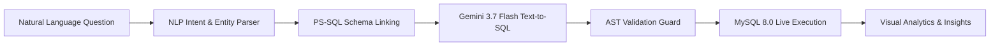

# 🤖 Data Analyst AI Studio — Flowise & PS-SQL

> **Autonomous Natural Language to SQL Analytics Agent** powered by **Flowise Orchestration Graph**, **PS-SQL Phrase-Based Schema Linking**, **AST SQL Validation**, and **Google Gemini 3.7 Flash**.

---

## 🏛️ Project Architecture & Folder Structure

```
data-analyst-ai-agent-with-flowise-using-ps-sql/
├── backend/                       # Node.js & TypeScript Analytical Backend
│   ├── agent.ts                   # Central multi-step pipeline coordinator
│   ├── nlp.ts                     # Intent detection & entity extraction engine
│   ├── pssql.ts                   # PS-SQL phrase-to-schema linking & pruning
│   ├── text2sql.ts                # Text-to-SQL query synthesis engine
│   ├── validator.ts               # AST parser & mutation blocker (Read-Only Guard)
│   ├── analyzer.ts                # Business insights & executive summary generator
│   ├── mysql.ts                   # Dual-mode live MySQL 8.0 client + embedded database
│   ├── flowise.ts                 # Flowise chatflow orchestration & node templates
│   ├── logger.ts                  # Central audit trail & latency telemetry
│   ├── testSuite.ts               # 32+ automated benchmark test suite
│   ├── serverRoutes.ts            # Express REST API endpoints
│   └── gemini.ts                  # Google GenAI SDK interface
│
├── database/                      # Relational Database Definitions
│   ├── schema.sql                 # MySQL DDL for retail_sales_db (7 tables)
│   └── seed.sql                   # Realistic enterprise retail dataset seeds
│
├── flowise/                       # Flowise Chatflow & Integration Assets
│   ├── flowise-chatflow.json      # Production-ready exportable Flowise workflow JSON
│   └── workflow-docs.md           # Flowise node specifications & lifecycle docs
│
├── frontend/                      # Modern React (JSX) Client Application
│   ├── index.html                 # Entry HTML (Plus Jakarta Sans, Outfit, JetBrains Mono)
│   └── src/
│       ├── App.jsx                # Root Application Component & Tab Controller
│       ├── main.jsx               # React DOM Entrypoint
│       ├── index.css              # Tailwind CSS, Glassmorphism & custom scrollbars
│       ├── components/            # 11 Modular UI components (.jsx)
│       │   ├── TopNav.jsx         # Glassmorphic header & status badges
│       │   ├── ChatAnalyst.jsx    # Analyst chat studio & prompt recommendations
│       │   ├── DatabaseExplorer.jsx # Interactive React Flow ER diagram & dictionary
│       │   ├── FlowiseVisualizer.jsx # Flowise workflow designer, runner & JSON export
│       │   ├── BenchmarkEvaluation.jsx # 32+ automated accuracy scorecard
│       │   ├── SqlConsole.jsx     # Dark IDE SQL query editor & history drawer
│       │   ├── SqlResultTable.jsx # Paginated, sortable table with CSV export
│       │   ├── PipelineStepViewer.jsx # 5-stage pipeline trace accordion
│       │   ├── SchemaLinkingVisualizer.jsx # PS-SQL alignment cards & join graph
│       │   ├── VisualAnalyticsViewer.jsx # Auto-chart engine (Bar, Ranking, Line, Area, Donut)
│       │   └── AuditLogsViewer.jsx # Central audit log search & modal inspector
│       ├── services/
│       │   └── api.js             # Client HTTP API methods (fetch)
│       └── types/
│           └── index.js           # JSDoc Type Definitions & Enums
│
├── .env.example                   # Environment configuration template
├── .gitignore                     # Git ignore rules
├── metadata.json                  # Application metadata
├── package.json                   # Project dependencies & npm scripts
├── server.ts                      # Full-stack production Express server
├── tsconfig.json                  # TypeScript compiler settings
└── vite.config.ts                 # Vite bundler config with frontend root & backend proxy
```

---

## ⚡ Key Capabilities & Pipeline



1. **PS-SQL Phrase-Based Schema Linking**:
   - Decomposes questions into semantic phrases (`"top selling products"`, `"monthly sales"`).
   - Computes Jaccard/Dice ngram similarity against column names, table descriptions, and aliases.
   - Prunes unrelated tables to construct a minimal SQL subgraph, preventing LLM hallucinations.

2. **AST Safety & Mutation Blocking**:
   - Parses the generated SQL through an Abstract Syntax Tree (AST) validator.
   - Strictly enforces read-only `SELECT` queries, rejecting destructive operations (`DROP`, `DELETE`, `UPDATE`, `ALTER`, `TRUNCATE`).

3. **Flowise Workflow Orchestrator**:
   - Visual flow designer on canvas with dynamic node addition, deletion, and simulation.
   - Exportable standard Flowise chatflow JSON compatible with remote Flowise instances.

4. **Interactive Visual Analytics Engine**:
   - Auto-detects optimal chart representations (KPI Cards, Vertical Bar, Ranking Bar, Trend Line, Filled Area, Donut Share, Raw Table).
   - Generates statistical summaries (Total, Average, Max Contributor, Min Item).

5. **32+ Benchmark Test Suite**:
   - Evaluates Intent Detection, PS-SQL Alignment, AST Safety, SQL Execution, and Executive Answer Correctness.

---

## 🚀 Quick Start Guide

### Prerequisites
- **Node.js**: v18.0.0 or higher
- **npm** or **bun**

### 1. Install Dependencies
```bash
npm install
```

### 2. Configure Environment Variables (Optional)
Copy `.env.example` to `.env`:
```bash
cp .env.example .env
```
- `GEMINI_API_KEY`: Set your Google Gemini API key (automatically available in AI Studio).
- `MYSQL_*`: Optional connection parameters for an external MySQL 8.0 database. If omitted, the application uses its built-in relational engine out of the box.

### 3. Run Development Server
```bash
npm run dev
```
Open [http://localhost:3000](http://localhost:3000) in your browser.

### 4. Build for Production
```bash
npm run build
npm start
```

---

## 📊 Database Schema (`retail_sales_db`)

The built-in database model contains 7 relational tables:
- **`products`**: Product catalog, categories, pricing, stock levels, reorder levels.
- **`customers`**: Customer profiles, loyalty tiers, cities, regions, registration dates.
- **`stores`**: Physical retail store locations, square footage, store types.
- **`sales`**: Transaction orders, sale dates, totals, payment methods, channel types.
- **`sales_items`**: Line-item details linking sales orders to products with unit discounts.
- **`promotions`**: Discount campaigns, promotional percentages, date windows.
- **`inventory`**: Warehouse stock levels, restock dates, supplier codes.

---

## 📝 License
MIT License.
